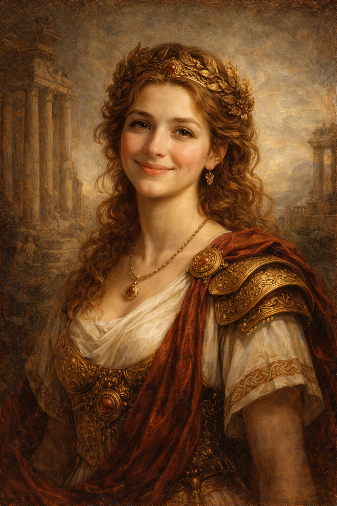

# GudWin Art

GudWin Art is a product showcase of an AI portrait experience: users upload a photo, choose a historical era, preview generation, and unlock HD after Telegram Stars payment.

## Product Scope

- Era-based generation flow for `pets` and `humans`.
- Supported eras in UI:
  - `Renaissance`
  - `Medieval`
  - `Ancient Rome`
  - `Beginning of Time`
- Guided funnel:
  - upload
  - crop
  - era/style selection
  - generation progress
  - payment gate
  - result download

## One-Minute Demo

1. Open `/create`.
2. Upload photo and adjust crop.
3. Select era (`Renaissance`, `Medieval`, `Ancient Rome`, `Beginning of Time`) and style.
4. Start generation and preview result.
5. Simulate Telegram Stars payment flow to unlock HD download.

## Current Showcase Features

- SPA built with `React + Vite + TypeScript + Tailwind`.
- RU/EN localization.
- Homepage with interactive era cards and era-specific examples.
- Create page with explicit era selector and style cards.
- Account pages for generation history and profile settings.
- Telegram-oriented auth/payment integration points (safe frontend contract).
- Legal pages and cookie banner for a production-like UX.

## Public Demo Boundaries

This repository is intentionally limited for public showcase:

- No production secrets.
- No private backend internals.
- No proprietary model logic or closed business rules.
- No customer personal data.

See `SECURITY.md` and `docs/API_CONTRACT.md` for details.

## Local Run

```bash
npm install
npm run dev
```

Build:

```bash
npm run build
```

## Environment

Create local `.env` from `.env.example` and set only demo-safe values:

```bash
cp .env.example .env
```

Variables currently used by this frontend:

- `VITE_SUPABASE_PROJECT_ID`
- `VITE_SUPABASE_PUBLISHABLE_KEY`
- `VITE_SUPABASE_URL`
- `VITE_TELEGRAM_BOT_USERNAME`
- `VITE_AI_API_URL`
- `VITE_AI_API_KEY`

## Structure

- `src/` - application pages, UI, state, routing.
- `public/examples/` - sample media for gallery cards.
- `supabase/functions/send-telegram/` - public-safe serverless integration example.
- `docs/` - architecture and API contracts.
- `screenshots/` - assets for portfolio presentation.

## Screenshots

Homepage era gallery:


Create flow (upload step):


Create flow (Ancient Rome example):



Create flow (Medieval example):


## Portfolio Positioning

This project is published to demonstrate product thinking, UX funnel design, and integration architecture.

Core production implementation (private backend, internal orchestration, security hardening, and advanced generation logic) is intentionally kept outside this public repository.

## License

All rights reserved. See `LICENSE`.
